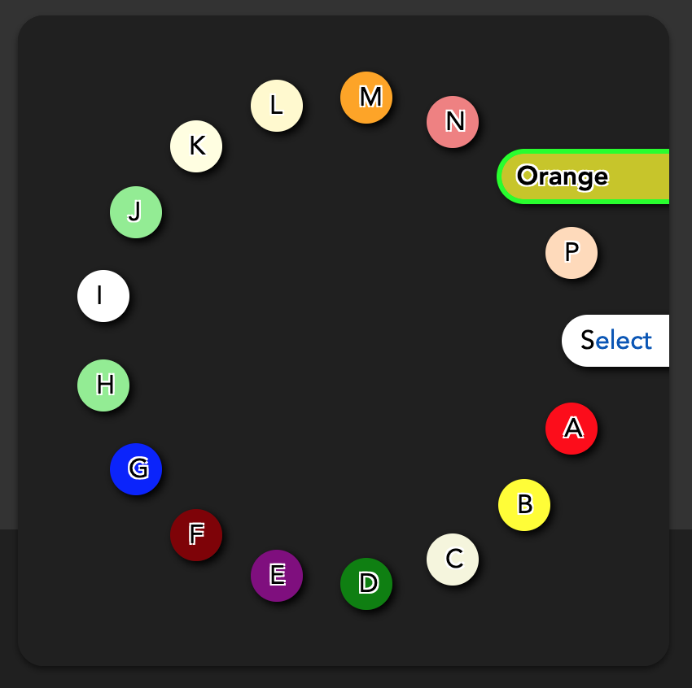

# stylable-select [](https://github.com/hchiam/stylable-select/releases)

A simulated select dropdown that can be styled with CSS across all browsers/OSs.

Tested on Chrome, Firefox, Mac, Android. Had some accessibility testing.


This project was generated using [hchiam](https://github.com/hchiam)'s [`project-template`](https://github.com/hchiam/project-template).

This GitHub repo serves as a more restorable backup of this CodePen demo:

https://codepen.io/hchiam/pen/wvprLpV

## Examples:

### [pill shape example](https://github.com/hchiam/stylable-select/tree/main/pill-shape-example):


### [circular example](https://github.com/hchiam/stylable-select/tree/main/circular-example):



## To run this GitHub repo demo:

(You'll need [`yarn`](https://github.com/hchiam/learning-yarn) set up.)

```sh
git clone https://github.com/hchiam/stylable-select
cd stylable-select
yarn
yarn dev
# http://localhost:3000
```

## To update this GitHub repo demo:

Update:

- `partials/CodePen.html`
- `CodePen.js`
- `CodePen.scss`

to match the CodePen demo https://codepen.io/hchiam/pen/wvprLpV
